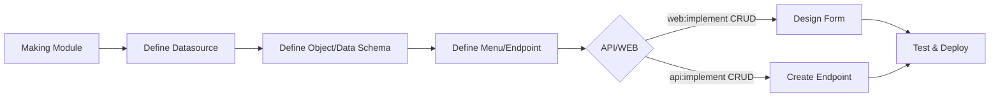

# Overview
this project aims to make no code app.  
this app use sveltekit with runes run on bun.  
it will have optional integration to other api project.  

# Use Case/ Goals:
- user can create REST API project using this app.  
- user can create ERP application from scratch using this app.  
- user can full System(API & Web App) from scratch using this app. 

# Principle
## DO
- make new function that is efficient reuseable
- if needed DEBUG log should be minimal
- use already created reusable component in src/lib/components (adjust it if needed)
- use already created reusable layout and its component in src/lib/components/sct (adjust it if needed)
   ex: SctForm placement, title is in slot pos, and action button is in stol act 
- make sure same UI/UX are implemented 
- if making new implementation: clean unused files, make sure other implementation use latest code

## Dont
- make massive comments and console.log on the code
- make redundant function, components, library
- use native html element or creating duplicate components

# Architecture

## Library Loading Strategy
**Core → Defaults → Generated → Runtime**

1. **CORE (Always Loaded)**
   - Base components, layouts, utils
   - System types and protection middleware
   - Foundation that everything extends

2. **DEFAULTS (Merged with Core)**  
   - Template components/data sources
   - Default page types and configurations
   - Readonly system templates

3. **GENERATED (User Created)**
   - Custom routes, modules, components
   - User data source configurations  
   - Workspace and drafts

4. **RUNTIME (Compiled Output)**
   - Fast-load JSON from YAML sources
   - Component registry and asset manifests

## Directory Structure
```
src/lib/
├── core/          # Always loaded foundation
├── defaults/      # System templates (readonly)  
├── workspace/     # User configurations (editable)
├── generated/     # Auto-generated content
└── runtime/       # Compiled outputs (.json from .yaml)
```

## File Strategy: Source vs Output
- **Source**: `.yaml` files (human-editable, designer interface)
- **Output**: `.json` files (fast runtime loading)
- **Compilation**: On-demand when designer saves YAML → immediately compile to JSON
- **Runtime**: Always loads `.json` for performance
- **Benefits**: Fresh JSON on every designer save, fast app loading

## Layouts (Clear Admin vs End-User Separation)

### 🔧 **Admin Layouts** (`src/lib/layouts/admin/`)
**For system administrators and designers:**
- **editor** - Editor layout for /designer routes (default admin)

### 👤 **End-User Layouts** (`src/lib/layouts/app/`) 
**For application end-users:**
- **modern** - Clean, modern UI (default app layout)
- **classic** - Traditional layout (fallback)  
- **floating** - Configurable floating layout

### 🎯 **Auto-Detection Logic**:
- `/designer/*` routes → Automatically use admin layouts
- All other routes → Use end-user app layouts
- Admins see designer modules only
- Users see app modules only (designer filtered out)  

## Current /designer modules
**- Modules** : here we setup what menu and module will the app will having  
**- Data** : here we create dataset of where the app will connected to (Rest API, Database, local File Storage)  
**- Component** : here where we create/configure what form component will be use in app and in form Builder  
**- Form** : here where we create/configure form for managing data (the form designer is drag and drop)  

## Process Flow:  


## UI/UX Design Pattern
**Replace Single Wizard → Dedicated Edit Components**

### Current (Awkward):
- Edit Data Source → Full wizard step 1
- Create Object → Full wizard step 1-2-3  
- Edit Object → Full wizard step 1-2-3

### Better (Focused):
- Edit Data Source → Modal/Page with just data source form
- Create Object → Modal/Page for object creation (data source pre-selected)
- Edit Object → Inline edit or dedicated object form
- Full Wizard → Only for complete new setup

### Component Breakdown:
- `DataSourceEditor.svelte` - Standalone data source editing
- `ObjectSchemaEditor.svelte` - Standalone object editing  
- `DataWizard.svelte` - Full flow for new setups only

## Current Architecture Problems

### 🔴 **Menu/Module ↔ Form Designer Disconnect**
**Problem**: Menu creation (`/designer/modules`) and Form design (`/designer/form`) are completely separate
- User creates menu route → No automatic form association
- User designs form → Must manually link to menu route  
- No unified "Create Page" flow that handles both

### 🔴 **Missing Integration Flow**
**Current**: Module → Data → Form → Component (all separate)
**Better**: Unified Page Creator that connects all pieces

## Core Functions Needed

### 🎯 **File Operations (Core Library)**
```typescript
// src/lib/core/file-system.ts
- readYAML(path: string): Promise<any>
- writeYAML(path: string, data: any): Promise<void>
- readJSON(path: string): Promise<any>  
- writeJSON(path: string, data: any): Promise<void>
- compileSvelte(template: string): Promise<string>
- parseInterface(filePath: string): Promise<InterfaceInfo[]>
```

### 🎯 **Schema Operations**
```typescript
// src/lib/core/schema.ts  
- validateSchema(schema: any): ValidationResult
- transformSchema(from: Format, to: Format): any
- generateFromSchema(schema: any, type: 'form' | 'api'): string
```

### 🎯 **Component Registry**
```typescript
// src/lib/core/components.ts
- getAvailableComponents(): ComponentDef[]
- registerComponent(def: ComponentDef): void
- renderComponent(type: string, props: any): string
```

## Better Integration Flow
**Unified Page Creator**:
1. Create Route/Menu → Auto-generate basic form template
2. Design Form → Auto-link to route 
3. Configure Data Source → Auto-populate form fields
4. One-click "Create CRUD Page" → Generates everything

## Functions to Move to Core Library

### 🔧 **File I/O Operations** → `src/lib/core/file-system.ts`
**From**: `/designer/data/dataAccess.ts`, `/designer/data/interfaceUtils.ts`
```typescript
// Currently scattered across files:
- readFileSync() operations
- writeFileSync() operations  
- existsSync() checks
- JSON.parse() / JSON.stringify()
- yaml.parse() / yaml.stringify()
```

### 🔧 **Schema Operations** → `src/lib/core/schema.ts`
**From**: `/designer/form/utils.ts`
```typescript
// Move these reusable functions:
- schemaToYaml(schema: FormElement[]): string
- yamlToSchema(yamlString: string): FormElement[]  
- schemaToJson(schema: FormElement[]): string
- jsonToSchema(jsonString: string): FormElement[]
- generateSvelteCode(schema: FormElement[]): string
- SchemaManager class (state management)
```

### 🔧 **Component Registry** → `src/lib/core/components.ts`
**From**: `/designer/form/utils.ts`
```typescript
// Move component mapping:
- COMPONENT_MAP: Record<string, Component>
- getComponent(type: string): Component | false
- NESTABLE_TYPES: Set<string>
```

### 🔧 **Route Management** → `src/lib/core/routes.ts`
**From**: `/designer/modules/route.ts`
```typescript
// Move reusable route functions:
- RouteConfigManager.load()
- RouteConfigManager.persist()
- listPaths(), getNodeByPath()
- reorderItems(), moveItemToParent()
```

### 🔧 **Interface Generation** → `src/lib/core/interfaces.ts`
**From**: `/designer/data/interfaceUtils.ts`
```typescript
// Move TypeScript generation:
- generateInterface(objectSchema: ObjectDef): string
- checkInterfaceExists(objectName: string): InterfaceStatus  
- addInterfaceToFile(), removeInterfaceFromFile()
```

### 🔧 **Data Utilities** → `src/lib/core/data.ts`
**From**: `/designer/form/utils.ts`
```typescript
// Move generic utilities:
- cloneData<T>(data: T): T
- getElementByPath(), insertElementAtPath()
- generateId(), validation functions
```